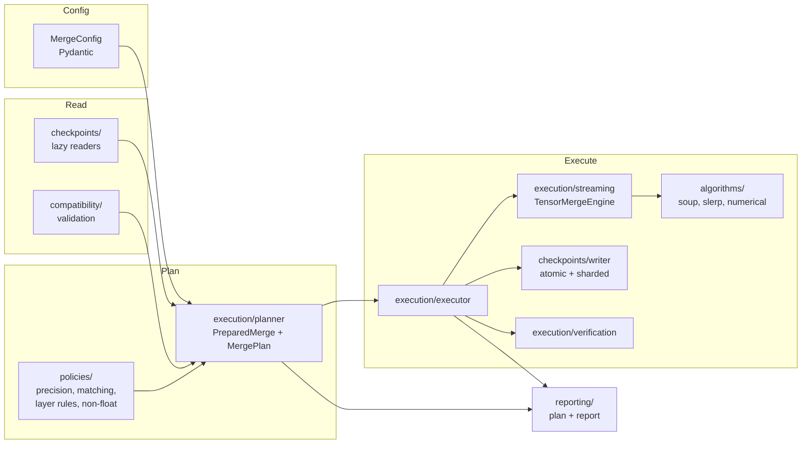
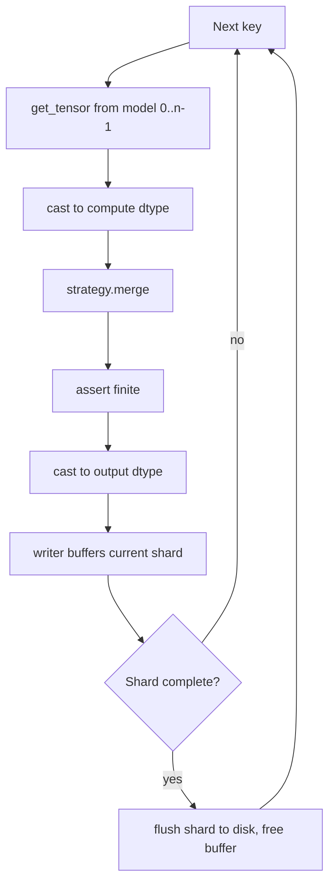
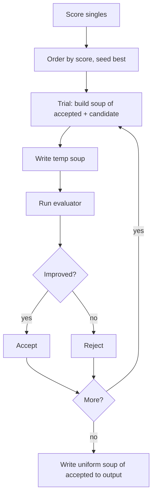
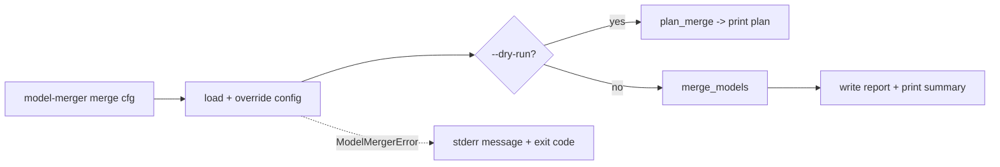

# Architecture

Model Merger separates **planning** (read-only, side-effect-free) from
**execution** (writes output), and keeps **numerical code** independent of
**I/O**. This makes the math exhaustively unit-testable and the plan inspectable
before anything is written.

## Component map



## Layers (bottom-up)

- **`types` / `exceptions` / `logging`** — enums, the exception hierarchy with
  exit codes, namespaced logging.
- **`utilities`** — hashing, filesystem safety (atomic dir, path containment),
  reproducibility (env capture, seeding), key patterns.
- **`algorithms`** — pure tensor math: `numerical` primitives, `uniform_soup`,
  `weighted_soup`, `slerp`/`linear`, and the `greedy_soup` selection policy. No
  I/O.
- **`policies`** — decisions layered on the math: `precision` (compute/output
  dtype), `matching` + `layer_rules` (which algorithm per tensor),
  `non_float_tensors`.
- **`checkpoints`** — lazy readers (`safetensors`, `pytorch`, `huggingface`),
  `sharding` planner, atomic `writer`, and the `open_checkpoint` factory.
- **`compatibility`** — tensor/architecture/tokenizer analysis producing findings.
- **`evaluation`** — evaluators for greedy soup (callable, command).
- **`execution`** — `planner` (builds the plan), `streaming` (the per-tensor merge
  engine), `executor` (writes + verifies), `verification`, `device`, `progress`.
- **`reporting`** — plan/report data models and JSON/Markdown serialization.
- **`api` / `cli`** — the public surfaces.

## Merge execution sequence

```mermaid
sequenceDiagram
    participant U as merge_models
    participant P as planner
    participant E as executor
    participant W as writer
    participant V as verification
    U->>P: prepare_merge(config)
    P->>P: open checkpoints (lazy)
    P->>P: validate compatibility (abort if blocking)
    P->>P: resolve per-tensor algorithm + dtype, plan shards
    P-->>E: PreparedMerge + MergePlan
    E->>E: disk preflight
    loop each tensor key (sorted)
        E->>E: load tensor from each model
        E->>E: merge in float32, cast to output dtype
        E->>W: add(key, tensor); release tensor
    end
    E->>W: finalize (write shards + index)
    E->>E: reconcile ancillary files
    E->>V: verify written output
    V-->>E: pass/fail (fail => raise, no success)
    E-->>U: MergeReport
```

## Checkpoint streaming



Only one shard's worth of output tensors and `n_models` source tensors are ever
resident. See [Memory & performance](memory-and-performance.md).

## Greedy-soup evaluation loop



## CLI flow



## Planning vs execution

`plan_merge` (and `merge --dry-run`) runs everything up to — but not including —
writing: it opens checkpoints, validates, resolves tensors, and computes the shard
layout, then closes the checkpoints. It mutates nothing. This is why `--dry-run`
is safe to run against a production output path.

## Failure recovery

Writes go to a staging directory that is renamed into place only on success; any
exception removes the staging directory and leaves the target untouched (see
[filesystem safety](security-and-trust.md)). Greedy temp soups are cleaned up
even on failure.
