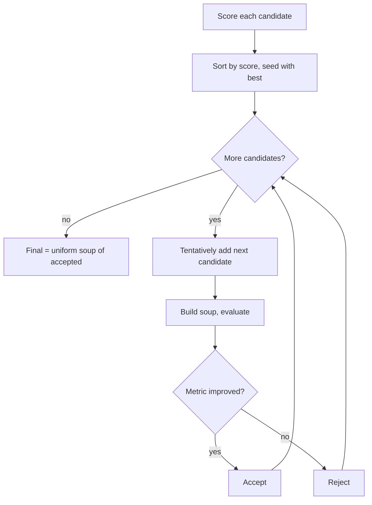

# Model soups

A *model soup* combines several models by averaging their weights. This page
covers the three variants and their tradeoffs.

## Uniform soup

The unweighted average of `n` models:

```
θ_soup = (1/n) · Σ θ_i
```

Every model contributes equally. Use it when you have several comparable
fine-tunes and no prior reason to favor one.

```yaml
algorithm:
  type: uniform_soup
```

## Weighted soup

A weighted combination with weights `w_i`:

```
θ_merged = Σ w_i · θ_i        (Σ w_i = 1)
```

Each model carries a `weight`. Two modes:

- **Normalized** (`normalize_weights: true`, default): weights are rescaled to
  sum to 1, so `[10, 10]` behaves like `[0.5, 0.5]`.
- **Strict** (`normalize_weights: false`): weights must already sum to 1 (within
  `1e-6`), or the config is rejected.

Negative weights are rejected unless `allow_negative: true`. Negative weights turn
interpolation into **extrapolation** (the result can lie outside the convex hull
of the inputs) — powerful but easy to misuse.

```yaml
algorithm:
  type: weighted_soup
  normalize_weights: true
models:
  - {path: ./a, weight: 0.5}
  - {path: ./b, weight: 0.3}
  - {path: ./c, weight: 0.2}
```

## Greedy soup

A uniform soup over *every* candidate can be worse than the best single model — a
few bad candidates drag the average down. A **greedy soup** (Wortsman et al.)
selects a subset:

1. Score every candidate individually.
2. Seed the soup with the single best candidate.
3. Consider the remaining candidates in descending score order. Tentatively add
   each to the soup, re-score, and keep it **only if the metric strictly
   improves**.
4. The final model is the uniform soup of the accepted subset.



### Evaluators

Greedy soup needs a way to score a merged checkpoint. Two kinds:

- **Callable** — a Python function `module:function` receiving the checkpoint
  path and returning a float.
- **Command** — an external program run with `{model_path}` substituted; it prints
  a bare float or `{"score": <float>}`. Executed with `shell=False` (no injection).

```yaml
algorithm:
  type: greedy_soup
greedy:
  direction: maximize      # or minimize (loss / perplexity)
  cache: true
  evaluator:
    type: command
    command: ["python", "score.py", "{model_path}"]
    metric_key: score
    timeout: 300
```

### Cost

Greedy soup builds and evaluates up to `n` temporary soups, each requiring a full
streaming merge plus one evaluation. With caching, repeated subsets are scored
once. It is far more expensive than a single soup; budget accordingly.

### Avoiding evaluation leakage

Selecting a subset by a metric **fits** to that metric's data. Use a **selection
set** for greedy scoring that is disjoint from the **final test set** you report,
or the reported number will be optimistic. See
[Evaluating a merged model](tutorials/evaluating-a-merged-model.md).

## Buffers and non-float tensors

Soups average floating-point parameters. Integer/boolean buffers, position ids,
and batch-norm counters are handled by the
[non-float policy](configuration-reference.md#non_float_tensors), not averaged.

## When soups work — and when they don't

Soups assume the models share a training basin. Independently trained models, or
models with permuted hidden units, generally do not soup well. Always evaluate;
see [Limitations](limitations.md).
