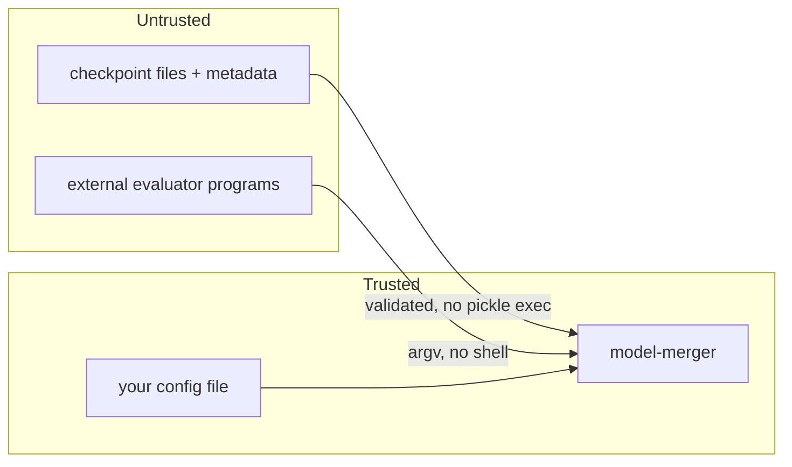

# Security and trust

Model files are **untrusted input**. Model Merger draws an explicit boundary
between the application and third-party checkpoints, configs, and evaluators.

## Trust boundary

## Threats and mitigations

### Pickle-backed checkpoints

`torch.load` can execute arbitrary code embedded in a pickle. Mitigation:
`weights_only=True` by default; full unpickling requires an explicit
`allow_unsafe_pytorch` / `--allow-unsafe` opt-in with a prominent warning. Prefer
safetensors, which cannot execute code.

### Path traversal

Shard filenames and ancillary file names can originate from checkpoint metadata.
Every written name is validated as a safe relative member (no `..`, no absolute
paths) before use; anything else is rejected. Reads/writes are confined to the
intended directories.

### Output overwrite and partial writes

Output is never overwritten unless `overwrite` is requested. Writes stage into a
sibling directory and rename into place atomically only on success; any failure
removes the staging directory and leaves the target untouched. A crash cannot
leave a corrupt output that looks complete.

### Command injection in evaluators

External evaluators run as an **argument vector** with `shell=False`. The
checkpoint path is substituted into a single argv element, so spaces or shell
metacharacters in a path are inert — there is no shell to interpret them.

### Untrusted / malformed metadata

Malformed shard indexes, missing shard files, and unsupported dtypes are rejected
with a `CheckpointError` rather than crashing or silently mis-reading.

### Resource exhaustion

A disk-space preflight (with margin) runs before writing. Temporary greedy soups
are cleaned up even on failure. Oversized single tensors get their own shard
rather than being force-fit.

### Secrets in configs / logs

Configs may reference paths or environment variables containing secrets. Values
under sensitive-looking keys are redacted from logs, and reports never include
raw config values or tokens.

### Dependency supply chain

Runtime dependencies are pinned with lower bounds and kept minimal;
`transformers` is an optional extra so the numerical core imports without it. CI
runs a dependency/security scan (see [Testing strategy](testing-strategy.md)).

## Reporting vulnerabilities

See [SECURITY.md](https://github.com/example/model-merger/blob/main/SECURITY.md)
for the private disclosure process and supported versions.
